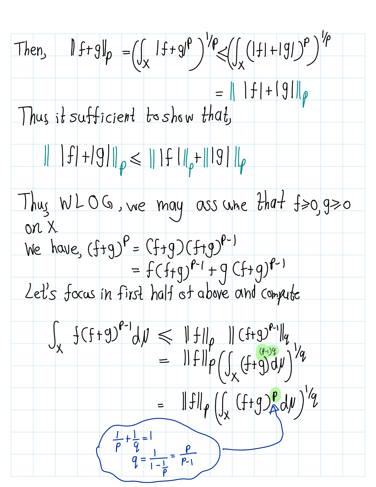

--- 
title: "Functinal Analaysis"
author: "Ashan De Silva"
date: "`r Sys.Date()`"
site: bookdown::bookdown_site
documentclass: book
#bibliography: [book.bib, packages.bib]
# url: your book url like https://bookdown.org/yihui/bookdown
# cover-image: path to the social sharing image like images/cover.jpg
description: |
  This is a i
link-citations: yes
github-repo: rstudio/bookdown-demo
---

# Banach space

## Lebesgue spaces
### a

```{definition}
markdown
Let \(X\) be a set. A **\(\sigma\)-algebra** \(\mathcal{I}\) on \(X\) is a collection of subsets of \(X\) such that:

1. \(\emptyset \in \mathcal{I}\),
2. if \(E \in \mathcal{I}\), then \(X \setminus E \in \mathcal{I}\),
3. if \(E_n \in \mathcal{I}\) for every \(n \ge 1\), then  
\[
       \bigcup_{n=1}^{\infty} E_n \in \mathcal{I}.
   \]
```

- Elements of $\mathcal{I}$ are called $\mathcal{I}$-measurable sets,
- $(X,\mathcal{I})$ is a measurable space.

```{definition}
A function \( f : X \to \mathbb{C} \) is said to be measurable if \[
f^{-1}\bigl(\{\, z \in \mathbb{C} : |z - a| < \delta \,\}\bigr) \in \mathcal{T}\] for every  $\delta > 0$ and $a \in \mathbb{C}$.
```

```{definition}
A (positive) measure is a function


\[
\mu : \mathcal{T} \to [0,\infty]
\]


which is countably additive, in the sense that if \(\{E_n\}_{n=1}^\infty\) is a countable collection of
disjoint measurable sets, then


\[
\mu\!\left( \bigcup_{n=1}^{\infty} E_n \right)
= \sum_{n=1}^{\infty} \mu(E_n).
\]

```

- The triple \((X, \mathcal{T}, \mu)\) is called a \emph{measure space}.

**Notation** :

- Let $0 < p < \infty$,
\[\mathcal{L}^p(X,\mathcal{I},\mu):=\left\{f:X\rightarrow \mathcal{C}:f \text{ is measurable and }\int_X |f|^p d\mu<\infty\right\}\] 
  - Such functions are said to be **$p$-integrable**.
  -  $\mathcal{L}^p$ norm of $f$ \(= ||f||_p=\left(\int_X|f|^p\, d\mu\right)^\frac{1}{p}\)
- $p=\infty$


\[
\mathcal{L}^{\infty}(X,\mathcal{T},\mu)
= \left\{
    f : X \to \mathbb{C} \;:\;
    \exists\, M > 0 \text{ such that } |f| < M \ \text{[\(\mu\)]-a.e. on } X
  \right\}.
\]


  - Such functions are said to be **essentially bounded**. 
  - The essential norm \(=\) \(\mathcal{L}^{\infty}\) norm of \(f=
\|f\|_{\infty}
= \inf \left\{ M > 0 : |f| < M \ \text{[\(\mu\)]-a.e. on } X \right\}.
\)
.png)
In this section we use the term **“norm.”** Strictly speaking, we have not yet verified that the expressions introduced actually satisfy the axioms of a norm. That verification will come later. For now, we use the word “norm” informally, with the understanding that its legitimacy will be established in due course.

```{lemma,lemma1.1.1}
Let \((X,\mathcal{T},\mu)\) be a measure space, let \(0 < p < \infty\), and let
\(f \in \mathcal{L}^{p}(X,\mathcal{T},\mu)\).
Then


\[
\|f\|_{p} = 0
\quad \iff \quad
f(x) = 0 \ \text{for [\(\mu\)]-a.e. } x \in X.
\]
```

```{proof}
.png)
.png)
```

**Fact**: \(\lambda \in \mathbb{C}, f\in \mathcal{L}^p(X,I,\mu), 0<p\geq\infty,||\lambda f||_p=|\lambda| ||f||_p\).

```{proof}
.png)
```


```{lemma}
Let \((X,\mathcal{T},\mu)\) be a measure space and let
\(f \in \mathcal{L}^{\infty}(X,\mathcal{T},\mu)\).
Then, for 
\[
|f(x)| \le \|f\|_{\infty} [\mu]-\text{a.e.} x \in X.
\]

```

.png)

**Result** : If $f,g\in \mathcal{L}^P(X,I,\mu)$ then $f+g\in \mathcal{L}^P(X,I,\mu)$

|$1\leq p <\infty$|$p=\infty$|
|:-:|:-:|
|.png)|.png)|

```{lemma,name="Young's inequality"}
Let \(a,b \ge 0\) and \(1 < p < \infty\). Let \(q\) be the conjugate exponent, i.e.


\(\frac{1}{p} + \frac{1}{q} = 1.\)


Then


\[
ab \le \frac{a^{p}}{p} + \frac{b^{q}}{q}.
\]


```

.png)
.png)

```{theorem,name="Holder's inequality"}
Fix \(1 \le p < \infty\) and let \(q\) be the conjugate exponent, i.e.


\(\frac{1}{p} + \frac{1}{q} = 1.\)


Let \(f,g : X \to \mathbb{C}\) be measurable functions. Then


\[
\int_X |f g| \, d\mu
\;\le\;
\left( \int_X |f|^{p} \, d\mu \right)^{1/p}
\left( \int_X |g|^{q} \, d\mu \right)^{1/q}=||f||_p ||f||_q.
\]


```

```{proof}
.png)
.png)
```

```{remark}
If $p=2$ then $q=2$ then Holder ineqaulty becomes  Cauchy -Schawrz inequlity.
```


```{theorem,mink,name="Minkowski's Inequality"}
Fix $1 \le p \le \infty$. Let $f,g : X \to \mathbb{C}$ be measurable functions. Then
\[
\|f + g\|_{p} \le \|f\|_{p} + \|g\|_{p}.
\]
```

```{proof}




```

Next, we consider the following question: 

**Question** : For which measurable functions \(f : X \to \mathbb{C}\) do we have \(\|f\|_{p} = 0\)?

**Answer**: By lemma \@ref(lemm:lemma1.1.1) $||f||_p=0 \iff f=0 ~[\mu] -$ a.e. Precisely those functions such that \(f(x) = 0\) for \(\mu\)-almost every \(x \in X\).

In particular, there are some functions \(f\) which are not identically zero but have zero \(\mathcal{L}^{p}\)-norm. This is unfortunate, so we typically consider the following quotient space:

We define


\[
{L}^{p}(X,\mathcal{T},\mu)
    = \frac{\mathcal{L}^{p}(X,\mathcal{T},\mu)}{N_{p}},
\]


where


\[
N_{p}
    = \{\, f \in \mathcal{L}^{p}(X,\mathcal{T},\mu) : \|f\|_{p} = 0 \,\}.
\]


We have seen that for any $\lambda \in \mathbb{C}$ and any 
$f, g \in \mathcal{L}^{p}(X,\mathcal{T},\mu)$, we always have


\begin{align*}
\|\lambda f\|_{p} &= |\lambda|\,\|f\|_{p},\\
\|f + g\|_{p} &\le \|f\|_{p} + \|g\|_{p}.\\
& \uparrow\\
&\text{ By Mink}\\
\end{align*}

**Claim**: $\mathcal{L}^p$ is vector space over $\mathbb{C}$.

```{proof}
1. Zero function

Let \(0(x) := 0\) for all \(x\). Then \(|0|^p = 0\) and \(
\int_X |0|^p\,d\mu = 0 < \infty,
\) so \(0 \in \mathcal{L}^p\).

2. Closed under scalar multiplication

Let \(f \in \mathcal{L}^p\) and \(\lambda \in \mathbb{C}\). Then
\[
|\lambda f|^p = |\lambda|^p |f|^p,
\]
so
\[
\int_X |\lambda f|^p\,d\mu
= |\lambda|^p \int_X |f|^p\,d\mu < \infty.
\]
Thus \(\lambda f \in \mathcal{L}^p\).

3. Closed under addition

Let \(f,g \in \mathcal{L}^p\). Use the standard inequality for \(p \ge 1\):
\[
|f+g|^p \le 2^{p-1}\big(|f|^p + |g|^p\big).
\]
Integrate:
\[
\int_X |f+g|^p\,d\mu
\le 2^{p-1} \left( \int_X |f|^p\,d\mu + \int_X |g|^p\,d\mu \right)
< \infty,
\]
since both integrals on the right are finite. Hence \(f+g \in \mathcal{L}^p\).

4. Vector space axioms

The pointwise operations
\[
(f+g)(x) := f(x)+g(x), \quad (\lambda f)(x) := \lambda f(x)
\]
inherit associativity, commutativity, distributivity, etc., from \(\mathbb{C}\). Together with steps 1–3, this shows \(\mathcal{L}^p(X,\mathcal{T},\mu)\) is a vector space over \(\mathbb{C}\).

Then
\[
L^{p}(X,\mathcal{T},\mu)
= \frac{\mathcal{L}^{p}(X,\mathcal{T},\mu)}{N_{p}}
\]
is the quotient of this vector space by the subspace \(N_p\), so it is also a vector space.
```

**Claim**: $N^p$ is subspace of $\mathcal{L}^p$

```{proof}
Let $f,g\in N^p$ and $\lambda\in \mathbb{C}$,

- $0_{map}\in N^p\implies N^p \neq \emptyset$
- $\|\lambda f\|_{p} = |\lambda|\,\|f\|_{p}=0$
- $\|f + g\|_{p} \le \|f\|_{p} + \|g\|_{p}=0 \implies \|f + g\|_{p}=0.$

Thus, $N^p$ is a subspace of $\mathcal{L}^p$.
```

Thus, $L^p$ is subspace. Hence, $N_{p}$ is a subspace of $L^{p}(X,\mathcal{T},\mu)$; therefore 
$L^{p}(X,\mathcal{T},\mu)$ is a vector space over $\mathbb{C}$.

If for $f \in L^{p}(X,\mathcal{T},\mu)$ we denote by $[f]$ its image
in the quotient space $L^{p}(X,\mathcal{T},\mu)$, then


\[
\lambda [f] + [g] = [\,\lambda f + g\,].
\]


Define 
\[\|[f]\|_p=\|f\|_p\]
More ever, \(\|[\cdot]\|_p\) well defined.

```{proof}
Let $f,g\in \mathcal{L}^p$
By Minkowski's inequlirty we can get,

\begin{equation}
\bigl|\,\|f\|_{p} - \|g\|_{p}\,\bigr|
    \;\le\;
    \|\,f - g\,\|_{p},
    \qquad f,g \in L^{p}(X,\mathcal{T},\mu).
\end{equation}

Suppos that $[f]=[g]$.
Then, $f-g\in N^p\implies f-g\in N^p$. Then $\|\,f - g\,\|_{p}=0$. Thus,

\begin{align*}\bigl|\,\|f\|_{p} - \|g\|_{p}\,\bigr|
    \;\le\;
    \|\,f - g\,\|_{p}=0 
    & \implies \|[f-g] \|_p=0\\ 
    &\implies \bigl|\,\|f\|_{p} - \|g\|_{p}\,\bigr|=0\\
    &\implies \,\|f\|_{p} = \|g\|_{p}
\end{align*}

```

Note that $\|[f]\|_p = 0$ if and only $[f] = 0_{L^p}$ in $L^p(X,I,\mu)$.

```{proof}

- $\mathbf{\implies}$ :   
\begin{align*}  
\|[f]\|_p = 0 &\implies \|f\|_p = 0.\\
&\implies f\in N^p \\
& \implies [f] = [0] = 0_{L^p}\\
\end{align*}
- $\mathbf{\Longleftarrow}$ :
\begin{align*}
 [f]=0_{L^p} & \implies [f]=[0]\\
& \implies f-0\in N^p\\
& \implies f\in N^p \\
& \implies \|f\|_p=0\\
& \implies \|[f]\|_p = \|f\|_p = 0.
\end{align*}
```

Now we can avoid the problem that have earlier. Now we can defnie the norm.

Here’s a clean, well‑structured Markdown version of your text, with mathematical expressions formatted clearly and consistently.

---

## A point of notation

For convenience, mathematicians agree to write \( f \) instead of \([f]\). This causes very little confusion; the only thing to keep in mind is that one can capture the behaviour of an element in \(L^p(X,\mathcal{T},\mu)\) only up to sets of zero \(\mu\)-measure. For the rest of this course, we will use this convention and write elements of the quotient space \(L^p\) simply as functions.

### Summary 

For \(1 \le p \le \infty\):

1. **Vector space:**   \(L^p(X,\mathcal{T},\mu)\) is a vector space over \(\mathbb{C}\).

2. **Definition of the \(p\)-norm:** To every \(f \in L^p(X,\mathcal{T},\mu)\) we associate a non‑negative number defined by  
   \[
   \|f\|_p = \left( \int_X |f|^p \, d\mu \right)^{1/p}, \qquad 1 \le p < \infty,
   \]
   and for \(p = \infty\),
   \[
   \|f\|_\infty = \inf\{ M \ge 0 : |f(x)| \le M \text{ for almost every } x \}.
   \]

3. **Homogeneity:** For every \(\lambda \in \mathbb{C}\) and \(f \in L^p(X,\mathcal{T},\mu)\),
   \[
   \|\lambda f\|_p = |\lambda|\, \|f\|_p.
   \]

4. **Triangle inequality:** For every \(f,g \in L^p(X,\mathcal{T},\mu)\),
   \[
   \|f + g\|_p \le \|f\|_p + \|g\|_p.
   \]

5. **Definiteness:** For every \(f \in L^p(X,\mathcal{T},\mu)\),
   \[
   \|f\|_p \ge 0,
   \]
   with equality if and only if \(f = 0\) almost everywhere.


Properties (iii), (iv), and (v) show that \(\|\cdot\|_p\) defines a norm, so \(L^p(X,\mathcal{I},\mu)\) is a **normed linear space**.

```{definition}
**Banach spaces** are normed linear spaces with an additional property: they are *complete*, meaning every Cauchy sequence converges. 
```
Our next task is to show that \(L^p(X,\mathcal{I},\mu)\) is a Bannch space. (We need to show that complete space)


Before doing so, we recall some important results from measure theory.

```{lemma,name="Chebyshev’s Inequality"}

Let \((X,\mathcal{T},\mu)\) be a measure space and let \(f\) be a non‑negative measurable function on \(X\).  
Then, for every \(\lambda > 0\),
\[
\mu\{x \in X : f(x) \ge \lambda\}
\;\le\;
\frac{1}{\lambda} \int_X f \, d\mu.
\]

```

```{proof}
Let $E_\lambda=\{x \in X : f(x) \ge \lambda\}$, Then,
\[
\int_X f \,d\mu \geq \int_{E_\lambda} f \,d\mu  \ge \int_{E_\lambda} \lambda \,d\mu =\lambda \int_{E_\lambda}  \,d\mu =\lambda \mu(E_\lambda)
\]
```

```{lemma,name="Borel–Cantelli Lemma"}

Let \((X,\mathcal{T},\mu)\) be a measure space and let \(\{E_n\}_{n=1}^\infty\) be a collection of measurable sets such that \(
\sum_{n=1}^\infty \mu(E_n) < \infty.
\)
Then \(\mu\)-almost every \(x \in X\) belongs to at most finitely many of the sets \(E_n\).

```

```{proof}
\begin{align*}
S&:=\left\{x\in X: x \text{  belongs to infinitly many }E_n\right\}\\
&=\bigcap_{N=1}^\infty \bigcup_{k=N}^\infty E_k (See latter picture.)
\end{align*}


\begin{align*}
\mu(S) &\le \mu \left(\cup_{k=N}^\infty\right)\\
& \le \sum_{k=N}^\infty \mu(E_k) \text{ for all } N
\end{align*}
Then left hand side is goes to zero as $N\to \infty$.

.png){width=50%}
```

```{lemma,name="Fatou’s Lemma"}

Let \((X,\mathcal{T},\mu)\) be a measure space and let \(\{f_n\}_{n=1}^\infty\) be a sequence of non‑negative measurable functions on \(X\). Then,
\[
\int_X \liminf_{n\to\infty} f_n \, d\mu
\;\le\;
\liminf_{n\to\infty} \int_X f_n \, d\mu.
\]

```


```{lemma}
Let \((X,\mathcal{T},\mu)\) be a measure space and let \(1 \le p \le \infty\). Let \(\{f_n\}_{n=1}^\infty \subset L^p(X,\mathcal{T},\mu)\) be a sequence such that there exists a sequence of positive numbers \(\{\varepsilon_n\}_{n=1}^\infty\) with \[\sum_{n=1}^\infty \varepsilon_n < \infty, \text{ and } 
\|f_n - f_{n+1}\|_p \le \varepsilon_n^2, \qquad n \ge 1.
\]

Then there exists \(f \in L^p(X,\mathcal{T},\mu)\) such that

- pointwise a.e. convergence:
  \[
  \lim_{n\to\infty} f_n(x) = f(x) \quad \text{for } \mu\text{-almost every } x \in X,
  \]

- convergence in \(L^p\):
  \[
  \lim_{n\to\infty} \|f - f_n\|_p = 0.
  \]

```

```{proof}
- \textbf{Claim 1}: $(f_n)$ is cauchy.

  For $n,m \ge 1$, consider follwing
  \begin{align*}
\| f_n-f_{n+m}\| 
&=\|f_n-f_{n+1}+f_{n+1}+\cdots +f_{n+m-1}-f_{n+m}\|\\
&=\|f_n-f_{n+1}\|+\|f_{n+1}-f_{n+2}\|+\cdots +\|f_{n+m-1}-f_{n+m}\|\\
&\ge \sum_{k=n}^{n+m-1} \|f_k-f_{k+1}\|\\
& \ge \sum_{k=n}^{n+m-1} \epsilon_k^2
\end{align*}
Then left hand side is goes to zero as $n \to 0$.
Thus, $(f_n)$ is cauchy.

- \textbf{Claim 2}: 
  - $p=\infty$: For $n,m \ge 1$ then we have  ,
\[\|f_n(x) − f_m(x)\| \le \|f_n −f_m\|_\infty \text{ for }[µ]\text{ -almost every} x \in X. \]
Hence, there is a measurable set \(E_{n,m} \subset X\) such that  \[\mu(X \setminus E_{n,m}) = 0 \text{ and } |f_n(x) - f_m(x)| \le \|f_n - f_m\|_\infty
\quad \text{for every } x \in E_{n,m}.
\]


Then the set \(E = \bigcap_{n,m} E_{n,m}\) is measurable and satisfies
\(\mu(X \setminus E) = 0,\) and moreover,


\[
|f_n(x) - f_m(x)| \le \|f_n - f_m\|_\infty
\quad \text{for every } x \in E \text{ and every } n,m \in \mathbb{N}.
\]


Thus, for every \(x \in E\), the sequence \(\{f_n(x)\}_n \subset \mathbb{C}\) is Cauchy.  
Since \(\mathbb{C}\) is complete, we may define a measurable function \(f : X \to \mathbb{C}\) by


\[
f(x) = \lim_{n \to \infty} f_n(x), \qquad x \in E.
\]


  - $p<\infty$
```

 
